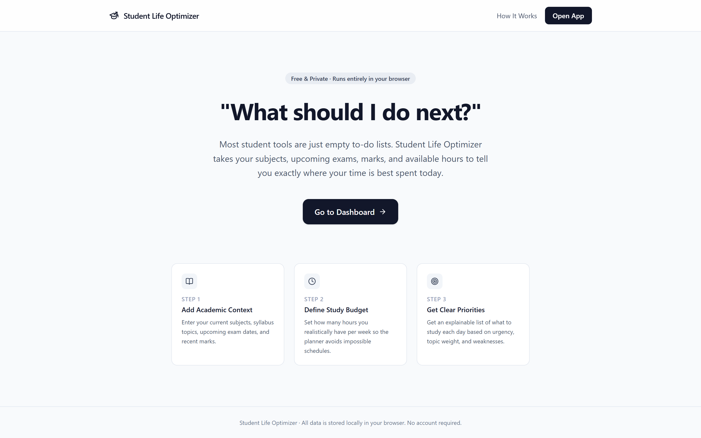
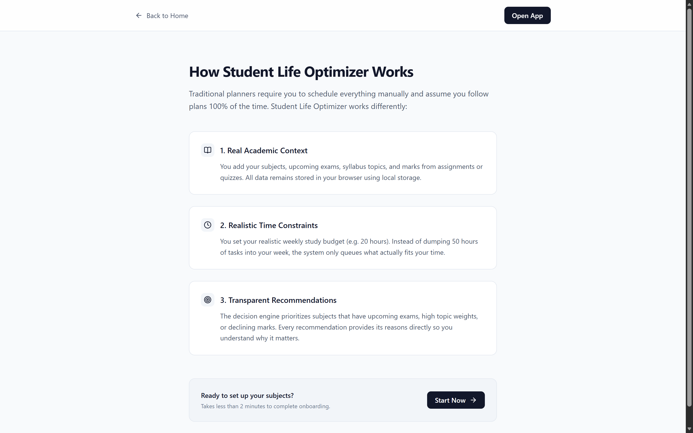

#  Student Life Optimizer

A browser-based academic decision engine that helps students prioritize what to study next.

## About

Most student productivity apps are basic to-do lists that treat every task the same. Student Life Optimizer answers the question "what should I do next?" by ranking your work using your deadlines, recent marks, syllabus confidence, and available study hours. It runs entirely in your browser with no account, no login, and no database.

## Screenshots

### Landing Page & Setup




### Dashboard (Daily Priorities)


### Study Planner (Adaptive Pacing)


### Academic Performance


### Exams & Readiness Breakdown


### Skills & Career Navigator


### Goals


### Smart Insights


## Features

- **Dashboard**: Shows your top daily priorities with suggested study minutes and plain-English reasons.
- **Study Planner**: Generates a weekly plan fitted to your study hours and adapts block durations based on logged study time.
- **Academic Performance**: Tracks marks trends across subjects and compares assessment scores over time.
- **Exams & Readiness**: Calculates readiness scores from syllabus coverage, topic confidence, and days remaining.
- **Skills & Career**: Compares your skills against curated career paths to highlight gaps and recommended next skills.
- **Goals**: Tracks short-term target grades and long-term career goals that feed into planning.
- **Insights**: Summarizes observations across your study habits, grades, and upcoming deadlines.
- **Profile & Settings**: Lets you edit subjects and study targets, reset data, or export and import JSON backups.

## Tech Stack

- React, TypeScript, Vite
- Tailwind CSS
- React Router
- Recharts
- Lucide React
- Vitest

## Getting Started

Prerequisites: Node.js and npm installed on your computer.

```bash
git clone https://github.com/Hetk8406/Student-Life-Optimizer.git
cd Student-Life-Optimizer
npm install
npm run dev
```

Then open http://localhost:5173 in your browser.

Optional commands:
- `npm test` - runs the test suite
- `npm run build` - builds the app for production

## Data Storage

All data is saved in your browser's localStorage. Clearing your browser data will delete everything. Use the Export button in the sidebar or Profile page to save a JSON backup, and use Import to restore it.
