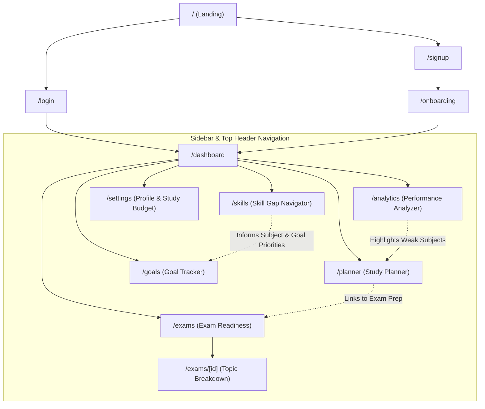
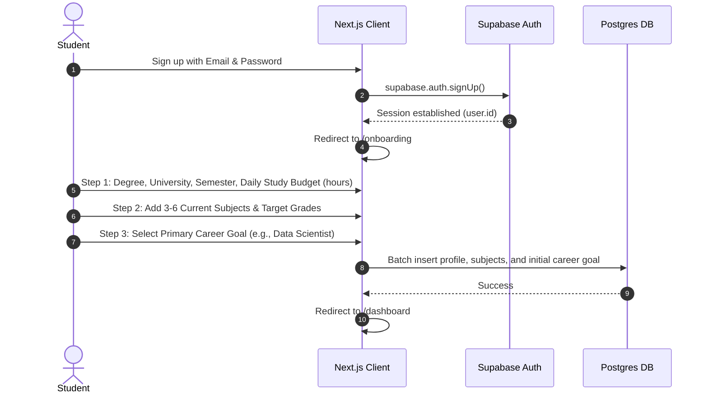
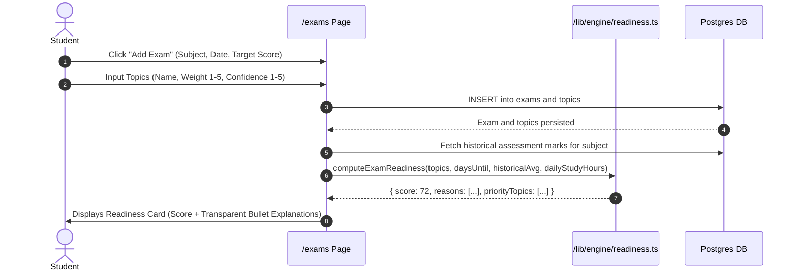
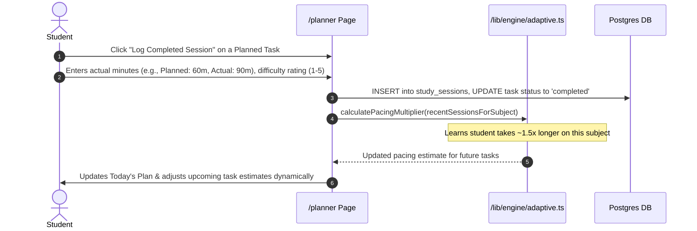
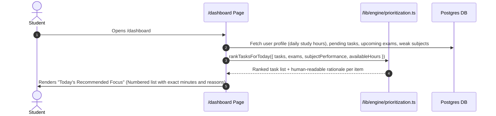
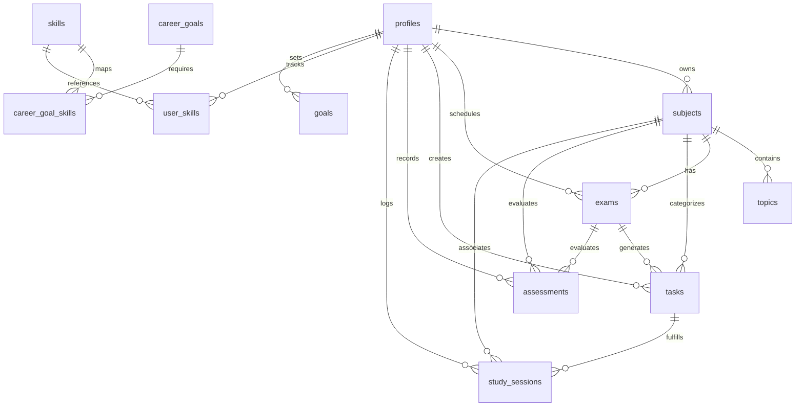

# STUDENT LIFE OPTIMIZER — ARCHITECTURE SPECIFICATION

> Document Version: 1.0  
> Status: Architecture Draft  
> Target Audience: Solo Student Developer / Pair Programming  
> Tech Stack: Next.js (App Router), TypeScript, Tailwind CSS, shadcn/ui, Supabase (Auth + PostgreSQL), Recharts

---

## 1. Information Architecture

### 1.1 Route Map

```
Public Routes
├── /                       (Landing Page — Value proposition, core philosophy)
├── /about                  (Product philosophy & explainable AI approach)
├── /login                  (Supabase Email/Password + OAuth)
└── /signup                 (Account registration)

Protected App Routes (Requires Supabase Session)
├── /onboarding             (First-time progressive profile & semester setup)
├── /dashboard              (Central command center: Today's Priorities, Readiness summary, Quick logs)
├── /planner                (Smart study planner, task queue, calendar/schedule view)
├── /exams                  (Upcoming exams, syllabus coverage, readiness scores & explanations)
├── /exams/[id]             (Exam deep-dive: topic breakdown, weight, targeted recommendations)
├── /analytics              (Academic performance analyzer, grade trends, study-time correlations)
├── /skills                 (Career goals, skill gap navigator, learning roadmap stages)
├── /goals                  (Short-term & long-term goal tracker)
└── /settings               (Profile management, degree details, daily study budget, theme)
```

### 1.2 Navigation & Page Interconnections



---

## 2. Main User Flows

### 2.1 User Flow 1: Onboarding


### 2.2 User Flow 2: Adding an Exam & Computing Readiness


### 2.3 User Flow 3: Logging a Study Session (Adaptive Planning)


### 2.4 User Flow 4: Viewing Today's Priorities (The Morning Check-In)


---

## 3. Database Schema (PostgreSQL / Supabase)

All tables use Row-Level Security (RLS) policies scoped to `auth.uid() = user_id`.



### 3.1 Table Definitions

#### `profiles`
Extends Supabase `auth.users`. Created via Postgres trigger upon signup.
| Column | Type | Constraints | Description |
|---|---|---|---|
| `id` | `uuid` | `PRIMARY KEY, REFERENCES auth.users(id) ON DELETE CASCADE` | User ID |
| `full_name` | `text` | `NOT NULL` | Student's name |
| `degree` | `text` | `NULLABLE` | e.g., B.Tech Computer Science |
| `university` | `text` | `NULLABLE` | University/College name |
| `semester` | `integer` | `DEFAULT 1` | Current semester/year |
| `daily_study_hours_target` | `numeric(3,1)` | `DEFAULT 3.0` | Available study hours per day |
| `primary_career_goal_id` | `uuid` | `REFERENCES career_goals(id) NULLABLE` | Current career target |
| `created_at` | `timestamptz` | `DEFAULT now()` | Creation timestamp |
| `updated_at` | `timestamptz` | `DEFAULT now()` | Last update timestamp |

#### `subjects`
Academic courses enrolled in for the active semester.
| Column | Type | Constraints | Description |
|---|---|---|---|
| `id` | `uuid` | `PRIMARY KEY DEFAULT gen_random_uuid()` | Subject ID |
| `user_id` | `uuid` | `NOT NULL REFERENCES profiles(id) ON DELETE CASCADE` | Owner |
| `name` | `text` | `NOT NULL` | e.g., "Mathematics III", "DBMS" |
| `code` | `text` | `NULLABLE` | e.g., "CS301" |
| `color` | `text` | `DEFAULT '#3b82f6'` | Hex color tag for charts & UI badges |
| `target_grade` | `numeric(4,1)` | `DEFAULT 80.0` | Student's target percentage |
| `is_archived` | `boolean` | `DEFAULT false` | Archive past semester subjects |
| `created_at` | `timestamptz` | `DEFAULT now()` | Creation timestamp |

#### `topics`
Granular syllabus items under a subject for tracking coverage and exam readiness.
| Column | Type | Constraints | Description |
|---|---|---|---|
| `id` | `uuid` | `PRIMARY KEY DEFAULT gen_random_uuid()` | Topic ID |
| `subject_id` | `uuid` | `NOT NULL REFERENCES subjects(id) ON DELETE CASCADE` | Parent subject |
| `user_id` | `uuid` | `NOT NULL REFERENCES profiles(id) ON DELETE CASCADE` | Owner |
| `name` | `text` | `NOT NULL` | e.g., "Eigenvalues and Eigenvectors" |
| `weight` | `smallint` | `DEFAULT 3 CHECK (weight BETWEEN 1 AND 5)` | Topic importance/weight in exam |
| `confidence_level`| `smallint` | `DEFAULT 3 CHECK (confidence_level BETWEEN 1 AND 5)`| Student self-rated mastery |
| `is_completed` | `boolean` | `DEFAULT false` | Revision/study status |
| `created_at` | `timestamptz` | `DEFAULT now()` | Creation timestamp |

#### `exams`
Upcoming major academic milestones.
| Column | Type | Constraints | Description |
|---|---|---|---|
| `id` | `uuid` | `PRIMARY KEY DEFAULT gen_random_uuid()` | Exam ID |
| `user_id` | `uuid` | `NOT NULL REFERENCES profiles(id) ON DELETE CASCADE` | Owner |
| `subject_id` | `uuid` | `NOT NULL REFERENCES subjects(id) ON DELETE CASCADE` | Subject tested |
| `title` | `text` | `NOT NULL` | e.g., "Mid-Term Examination" |
| `exam_date` | `date` | `NOT NULL` | Date of the exam |
| `target_score` | `numeric(4,1)` | `DEFAULT 85.0` | Target score percentage |
| `notes` | `text` | `NULLABLE` | Room number, syllabus notes |
| `created_at` | `timestamptz` | `DEFAULT now()` | Creation timestamp |

#### `tasks`
Individual study tasks, assignment deadlines, or revision milestones.
| Column | Type | Constraints | Description |
|---|---|---|---|
| `id` | `uuid` | `PRIMARY KEY DEFAULT gen_random_uuid()` | Task ID |
| `user_id` | `uuid` | `NOT NULL REFERENCES profiles(id) ON DELETE CASCADE` | Owner |
| `subject_id` | `uuid` | `NOT NULL REFERENCES subjects(id) ON DELETE CASCADE` | Related subject |
| `exam_id` | `uuid` | `NULLABLE REFERENCES exams(id) ON DELETE SET NULL` | Linked exam if applicable |
| `title` | `text` | `NOT NULL` | Task headline |
| `task_type` | `text` | `CHECK (task_type IN ('assignment', 'exam_prep', 'revision', 'reading', 'project'))` | Category |
| `due_date` | `timestamptz` | `NULLABLE` | Deadline timestamp |
| `estimated_minutes`| `integer` | `DEFAULT 60` | Estimated duration |
| `status` | `text` | `DEFAULT 'pending' CHECK (status IN ('pending', 'in_progress', 'completed', 'cancelled'))` | Completion state |
| `created_at` | `timestamptz` | `DEFAULT now()` | Creation timestamp |

#### `study_sessions`
Log of actual time spent studying; fuels the adaptive planning engine.
| Column | Type | Constraints | Description |
|---|---|---|---|
| `id` | `uuid` | `PRIMARY KEY DEFAULT gen_random_uuid()` | Session ID |
| `user_id` | `uuid` | `NOT NULL REFERENCES profiles(id) ON DELETE CASCADE` | Owner |
| `task_id` | `uuid` | `NULLABLE REFERENCES tasks(id) ON DELETE SET NULL` | Associated planned task |
| `subject_id` | `uuid` | `NOT NULL REFERENCES subjects(id) ON DELETE CASCADE` | Subject studied |
| `planned_minutes` | `integer` | `NOT NULL` | Planned duration |
| `actual_minutes` | `integer` | `NOT NULL` | Actual minutes logged |
| `completion_status`| `text` | `CHECK (completion_status IN ('completed', 'partial', 'skipped'))` | Execution outcome |
| `perceived_difficulty`| `smallint` | `CHECK (perceived_difficulty BETWEEN 1 AND 5)` | 1 = Very Easy, 5 = Very Hard |
| `notes` | `text` | `NULLABLE` | Student notes/reflections |
| `session_date` | `date` | `DEFAULT CURRENT_DATE` | Date session occurred |
| `created_at` | `timestamptz` | `DEFAULT now()` | Creation timestamp |

#### `assessments`
Gradebook entries for quizzes, assignments, and test marks.
| Column | Type | Constraints | Description |
|---|---|---|---|
| `id` | `uuid` | `PRIMARY KEY DEFAULT gen_random_uuid()` | Assessment ID |
| `user_id` | `uuid` | `NOT NULL REFERENCES profiles(id) ON DELETE CASCADE` | Owner |
| `subject_id` | `uuid` | `NOT NULL REFERENCES subjects(id) ON DELETE CASCADE` | Subject evaluated |
| `exam_id` | `uuid` | `NULLABLE REFERENCES exams(id) ON DELETE SET NULL` | Linked exam if applicable |
| `title` | `text` | `NOT NULL` | e.g., "Quiz 1", "Midterm Lab Test" |
| `assessment_type` | `text` | `CHECK (assessment_type IN ('quiz', 'assignment', 'midterm', 'final', 'project'))` | Type |
| `score` | `numeric(5,2)` | `NOT NULL` | Marks scored |
| `max_score` | `numeric(5,2)` | `NOT NULL` | Total possible marks |
| `percentage` | `numeric(5,2)` | `GENERATED ALWAYS AS ((score / max_score) * 100) STORED` | Normalized percentage |
| `assessment_date` | `date` | `DEFAULT CURRENT_DATE` | Date received |
| `created_at` | `timestamptz` | `DEFAULT now()` | Creation timestamp |

#### `skills` (Global Catalog)
Predefined skill inventory.
| Column | Type | Constraints | Description |
|---|---|---|---|
| `id` | `uuid` | `PRIMARY KEY DEFAULT gen_random_uuid()` | Skill ID |
| `name` | `text` | `UNIQUE NOT NULL` | e.g., "Python", "SQL", "Linear Algebra" |
| `category` | `text` | `CHECK (category IN ('programming', 'mathematics', 'data', 'tools', 'core_cs', 'soft_skills'))` | Skill group |
| `description` | `text` | `NULLABLE` | Short summary of skill |

#### `career_goals` (Global Catalog)
Predefined standard career tracks for college students.
| Column | Type | Constraints | Description |
|---|---|---|---|
| `id` | `uuid` | `PRIMARY KEY DEFAULT gen_random_uuid()` | Career Track ID |
| `title` | `text` | `UNIQUE NOT NULL` | e.g., "Data Scientist", "Software Engineer" |
| `description` | `text` | `NOT NULL` | High-level summary of the role |

#### `career_goal_skills` (Global Mapping)
Benchmark competencies and importance for target roles.
| Column | Type | Constraints | Description |
|---|---|---|---|
| `id` | `uuid` | `PRIMARY KEY DEFAULT gen_random_uuid()` | Mapping ID |
| `career_goal_id` | `uuid` | `NOT NULL REFERENCES career_goals(id) ON DELETE CASCADE` | Target role |
| `skill_id` | `uuid` | `NOT NULL REFERENCES skills(id) ON DELETE CASCADE` | Target skill |
| `required_level` | `smallint` | `CHECK (required_level BETWEEN 1 AND 5)` | 1 = Novice, 5 = Expert |
| `importance_weight`| `smallint` | `CHECK (importance_weight BETWEEN 1 AND 5)` | Criticality for role |
| `roadmap_stage` | `smallint` | `DEFAULT 1` | Stage 1 (Foundational) to 5 (Specialized) |

#### `user_skills`
Student's self-assessed competence in specific skills.
| Column | Type | Constraints | Description |
|---|---|---|---|
| `id` | `uuid` | `PRIMARY KEY DEFAULT gen_random_uuid()` | Entry ID |
| `user_id` | `uuid` | `NOT NULL REFERENCES profiles(id) ON DELETE CASCADE` | Owner |
| `skill_id` | `uuid` | `NOT NULL REFERENCES skills(id) ON DELETE CASCADE` | Skill |
| `current_level` | `smallint` | `CHECK (current_level BETWEEN 1 AND 5)` | Current rating (1-5) |
| `updated_at` | `timestamptz` | `DEFAULT now()` | Last updated date |

#### `goals`
Explicit student milestones (short-term & long-term).
| Column | Type | Constraints | Description |
|---|---|---|---|
| `id` | `uuid` | `PRIMARY KEY DEFAULT gen_random_uuid()` | Goal ID |
| `user_id` | `uuid` | `NOT NULL REFERENCES profiles(id) ON DELETE CASCADE` | Owner |
| `title` | `text` | `NOT NULL` | e.g., "Score >80% in Statistics" |
| `goal_type` | `text` | `CHECK (goal_type IN ('short_term', 'long_term'))` | Timeframe |
| `target_date` | `date` | `NULLABLE` | Target completion date |
| `status` | `text` | `DEFAULT 'active' CHECK (status IN ('active', 'completed', 'abandoned'))` | State |
| `subject_id` | `uuid` | `NULLABLE REFERENCES subjects(id) ON DELETE SET NULL` | Linked subject |
| `career_goal_id`| `uuid` | `NULLABLE REFERENCES career_goals(id) ON DELETE SET NULL` | Linked career track |
| `created_at` | `timestamptz` | `DEFAULT now()` | Creation timestamp |

---

## 4. Next.js Project Structure

Designed for clean separation of concerns, high maintainability, and zero unnecessary boilerplate.

```
student-life-optimizer/
├── app/
│   ├── (auth)/
│   │   ├── login/
│   │   │   └── page.tsx
│   │   └── signup/
│   │       └── page.tsx
│   ├── (dashboard)/
│   │   ├── layout.tsx             # Shared App Shell (Sidebar, Header, Profile summary)
│   │   ├── dashboard/
│   │   │   └── page.tsx           # Daily priorities, recent performance, exam radar
│   │   ├── planner/
│   │   │   └── page.tsx           # Weekly / daily task allocation, logging modal
│   │   ├── exams/
│   │   │   ├── page.tsx           # List of exams + readiness cards
│   │   │   └── [id]/
│   │   │       └── page.tsx       # Exam topic breakdown & readiness diagnostic
│   │   ├── analytics/
│   │   │   └── page.tsx           # Performance trends, subject comparisons (Recharts)
│   │   ├── skills/
│   │   │   └── page.tsx           # Career role selection, gap cards, staged roadmap
│   │   ├── goals/
│   │   │   └── page.tsx           # Short & long term goal tracker
│   │   └── settings/
│   │       └── page.tsx           # Daily hours budget, profile info
│   ├── onboarding/
│   │   └── page.tsx               # 3-step progressive onboarding wizard
│   ├── api/                       # Minimal route handlers (e.g. webhooks, auth callbacks)
│   ├── layout.tsx                 # Root layout (Inter font, Theme provider, Toaster)
│   ├── page.tsx                   # Public marketing landing page
│   └── globals.css                # Tailwind base styles & color tokens
├── components/
│   ├── ui/                        # shadcn/ui components (button, card, dialog, input, etc.)
│   ├── layout/                    # AppHeader, Sidebar, UserNav, MobileNav
│   ├── dashboard/                 # PriorityTaskList, QuickLogButton, ReadinessOverview
│   ├── planner/                   # TaskCard, LogSessionDialog, ScheduleTimeline
│   ├── exams/                     # ExamCard, TopicList, ReadinessScoreWidget
│   ├── analytics/                 # TrendLineChart, SubjectBarChart, StudyCorrelationChart
│   ├── skills/                    # SkillGapBar, CareerSelector, RoadmapTimeline
│   └── shared/                    # EmptyState, StatCard, ScoreExplanationBadge
├── lib/
│   ├── engine/                    # PURE, TESTABLE TYPESCRIPT LOGIC (No React, No Supabase)
│   │   ├── types.ts               # Input/Output domain models for intelligence calculations
│   │   ├── prioritization.ts      # Task ranking algorithm with transparent reason generation
│   │   ├── readiness.ts           # Exam readiness scoring (weight, confidence, historical marks)
│   │   ├── adaptive.ts            # Pacing adjustment calculation (actual vs planned ratios)
│   │   ├── skill-gap.ts           # Career gap identification and roadmap stage sequencing
│   │   └── insights.ts            # Rule-based heuristics for dashboard alert callouts
│   ├── supabase/
│   │   ├── client.ts              # Browser Supabase client (createBrowserClient)
│   │   ├── server.ts              # Server Component / Action client (createServerClient)
│   │   └── middleware.ts          # Auth session refresh & route protection middleware
│   └── utils.ts                   # Tailwind cn() helper, date formatters
├── types/
│   └── database.ts                # Auto-generated or manual Supabase schema types
├── docs/
│   ├── PRD.md                     # Master Product Vision & Requirements
│   └── ARCHITECTURE.md            # This document
├── middleware.ts                  # Next.js middleware hooking into lib/supabase/middleware.ts
├── tailwind.config.ts
├── tsconfig.json
└── package.json
```

---

## 5. Feature Staging: MVP vs. Future Releases

| Module / Feature | MVP (Scope for First Build) | Future Releases (Architected For Later) |
|---|---|---|
| **Auth & Profile** | Email/password auth, basic profile (degree, semester, daily study hours budget). | Google/GitHub SSO, multi-institution syllabus auto-detect. |
| **Subjects & Topics** | CRUD subjects and syllabus topics with weight (1-5) and confidence (1-5). | Syllabus PDF upload + automatic AI topic extraction. |
| **Smart Prioritization** | Deterministic prioritization function in `/lib/engine/prioritization.ts` weighing urgency, weakness, and target hours with full explanation strings. | Machine-learning-based personalized priority weighting. |
| **Study Planner** | Daily planned tasks, log session modal (planned vs. actual minutes, difficulty rating). | Bidirectional 2-way sync with Google Calendar / Outlook. |
| **Adaptive Loop** | Pacing multiplier per subject based on average discrepancy between planned and actual study time. | Deep predictive modeling for student burnout & fatigue patterns. |
| **Performance Analyzer**| Assessment grade logger (quizzes, midterms, finals), trend lines, weak subject identification via Recharts. | Class/cohort anonymous percentile benchmarking. |
| **Exam Readiness** | Deterministic score (0-100%) computed from syllabus completion, weighted confidence, and recent marks, paired with 3-4 bullet-point explanations. | Multi-semester exam grade prediction with confidence intervals. |
| **Skill Gap Navigator** | 5-8 curated career paths (Data Scientist, Web Dev, etc.), user skill ratings (1-5), gap calculation, and linear stage roadmap. | Dynamic job market scraping, resume parsing, specific course/resource affiliate recommendations. |
| **Dashboard Insights** | Top 2-3 rule-based actionable insights generated from current data state. | LLM-driven conversational study advisor. |

---

## 6. Implementation Notes for the Solo Student Developer

1. **Keep Engine Functions Pure**: Every file in `lib/engine/` must accept plain JavaScript objects and return plain objects. No database calls, no React hooks. This makes writing unit tests fast and straightforward.
2. **Every Score Has Reasons**: Any calculation that yields a number (such as `readinessScore` or `taskPriorityScore`) must output an array of strings: `reasons: string[]`. The UI displays these reasons directly in tooltips or badges.
3. **Empty States Over Demo Data**: If the user has 0 subjects, show an informative card with a single primary button: *"Add your first subject to unlock smart study recommendations"*. Do not fill the database with fake placeholders.
4. **Clean Design Palette**: Use a calm slate/neutral palette with single-color accents for status (e.g., emerald for on-track, amber for attention needed, rose for deadline urgency). No distracting gradients or glassmorphism.
